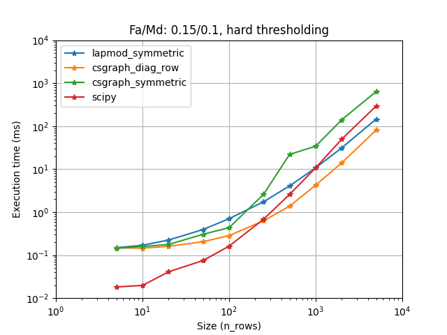
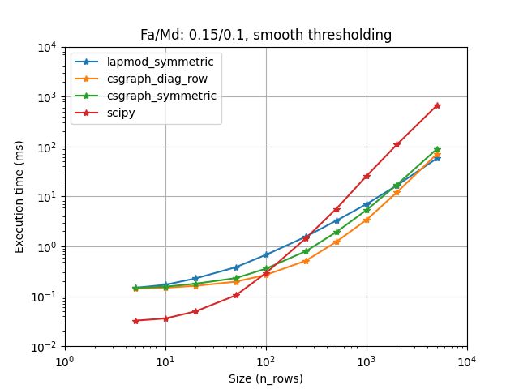

# Pylapy

[](https://github.com/raphaelreme/pylapy/actions/workflows/tests.yml)

We provide a solver for the assignement problem with Hungarian algorithm (Jonker-Volgenant variants [1]). It also supports sparse assignment problem.

The main class (`pylapy.LapSolver`) is a wrapper around different implementations you can find in python: lap (lapjv and lapmod), lapjv, scipy (linear_sum_assignment, csgraph), lapsolver [2, 3, 4, 5, 6].

It unifies the functionality of each implementation and allows you to use the one which is the fastest
on your problem. Note that to solve the same problem, an implementation/method can be more than 10 times slower than an other one.

It also helps you to handle non square matrices and setting a soft threshold on assignements (usually leads
to better performances than hard thresholding).

We provide some benchmark (but they are a bit hard to read and messy). Given your lap problem, try to make it work with the simplest implementation (scipy) and then (if needed) try to install lap or lapjv and see if they yield better computational performances.


## Install

```bash
$ pip install pylapy
$
$ # By default it does not install any backend solver
$ # You can either install by hand your favorite solver (scipy, lap, lapjv, lapsolver)
$ pip install pylapy[scipy]  # or pylapy[lap] etc
$
$ # Note that some backend requires numpy to be installed correctly [for instance, the old lap distribution]
$ # You may need to install numpy before
$ pip install numpy
$
$ # For sparse matrices, it requires scipy and numba.
$ pip install pylapy[sparse]  # Will install pylapy with scipy and numba
```

As of today:
- lapjv do not support macos. The recent versions of lapjv (>= 1.3.25) uses numpy2.0 which is only available for Python3.9.
- lapsolver do not support python > 3.10.
- We now use [lapx](https://github.com/rathaROG/lapx) which distributes correctly the lap package.


## Getting started

```python

import numpy as np
import pylapy

# Simulate data
n, m = (2000, 2000)
sparsity = 0.5

dist = np.random.uniform(0, 1, (2000, 2000))
dist[np.random.uniform(0, 1, (2000, 2000)) < sparsity] = np.inf

# Create the solver and solve

solver = pylapy.LapSolver()  # Choose the current most efficient method that is installed
# solver = pylapy.LapSolver("scipy"|"lap"|"lapjv"|"lapsolver")  # You can choose which method you rather use


links = solver.solve(dist)
# Or if you have a threshold that removes most links
links = solver.sparse_solve(dist, 0.1)

# Find the final cost

print(dist[links[:, 0], links[:, 1]])
```

## Benchmarks

We provide several scripts (and corresponding plots) in the `benchmark/` folder. They compare different implementations
and dist extensions (for non square matrix or soft thresholding). We have only tested them on a intel core i7 with Ubuntu 20.04
and python 3.10. Thus we do not guarantee that the choice we make by default are the fastest for you. 

### TLDR
Lapjv seems to usually outperform other implementations (Up to 2 times faster). Lap and Scipy are also pretty fast and can sometimes be faster than Lapjv. Lapsolver is usually much slower and should be avoided.

To handle soft thresholding and non-square matrices, we use by default the fastest options of our benchmark. This can be changed by setting
`LapSolver.cost_extension` and `LapSolver.shape_extension`.

When the cost is sparse, using `sparse_solve` may again give you a ten-fold speed increase. The fastest approach seems to be csgraph (from scipy), but lapmod (from lap) is not far behind. We use cost extension to handle infeasible problems, non-square ones and soft thresholding. By default, we use the fastest choice on our benchmark for each method. But for csgraph, with very sparse problems, it may be worth to use `LapSolver.sparse_extension` = "symmetric_cost".


### Handling non square matrices

With a rectangular assignment problem, you have to extend the distance matrix into a square one. There are multiple ways
to perform this shape extension. All yield the same final links and cost some are much faster/slower than others.

We provide several shape extension functions and benchmark them. By default, the solver uses the fastest one for the implementation you use.
You can build your own or enforce another one by setting the `LapSolver.shape_extension` attribute. Please have a look at
`shape_extension` module and `benchmark_shape_extension` script for more details.

  


According to our benchmark, we use `smallest_fill_inf` for scipy [4] and smallest_fill_0 for other implementations. (Note that lap [2] provide its own implementation displayed as `ref` here.)

### Handling soft thresholding

Rather than applying hard thresholding and cut links that are above a threshold `eta`, it is common and usually
better to assign a row or a column to "no one" with a cost `eta`. This is done by adding "sink" rows and columns.
When a true row/column is linked to a "sink" column/row, it is considered non linked.

Adding these sink nodes can also be done multiple ways resulting in equivalent links/cost but different run time.
We provide several cost extension functions and benchmark them. By default, the solver uses the expected fastest one
for the implementation you use. You can build your own extension or enforce another one by setting the `LapSolver.cost_extension`
attribute. Please have a look at `cost_extension` module and `benchmark_cost_extension` script for more details.

  


It is less obvious to descriminate between the cost extension functions (Even more if you add sparsity: more plots in `benchmark/images/cost_extension`). Nonetheless,
we decided to go with `diag_split_cost` for lapsolver [5] and `row_cost` for other implementations that usually leads to the best performances.

### Handling sparse matrix

When the cost is sparse (often true), the sparse algorithm from Jonker-Volgenant may be used. It is implemented in scipy.sparse.csgraph and lap.lapmod. These implementations do not support non-feasible matrix (where the maximum number of links is smaller than the number of rows and the number of columns). Moreover, lapmod only supports square matrices.

To handle soft thresholding, feasibility and non-square matrices, we implemented sparse cost extensions, that extend the cost to a feasible sparse (and optionnally square) cost matrix. We defined 2 main methods that we benchmarked and we choose for each implementation the fastest one. For scipy, it seems that the other method could be faster when the matrix is extra sparse. You can change the extension or give one of your one by setting the `LapSolver.sparse_extension`. Please have a look at `sparse` module and `sparse_benchmark` script for more details.

 


### Choosing the implementations

First, some implementations are not available on some operating system or python version, our wrapper allows you to switch between implementations without
changing your code. It seems that for instance, lap is not available for python 3.6, lapjv is not available in macOs, etc.

Also you want to choose the fastest one for your problem. We have compared all implementations on several cases (using sparsity, rectangular problems, and cost limit):

  


It seems that lapjv is usually faster than other implementations. Scipy and lap are also pretty fast and can be faster than lapjv depending on your use case. Lapsolver is always outperformed and should be avoided.

Note that lapmod on these figures is outdated, the current implementation on LapSovler.sparse_solve is much faster. See Handling sparse matrix for more details.

Warning: For rectangular matrices, lapjv seems to sometimes output a non-optimal cost (though very close to the optimal one)

## References

* [1] R. Jonker and A. Volgenant, "A Shortest Augmenting Path Algorithm for Dense and Sparse Linear Assignment Problems", Computing 38, 325-340 (1987)
* [2] "lap: Linear Assignment Problem solver", https://github.com/gatagat/lap (Now maintained at https://github.com/rathaROG/lapx)
* [3] "lapjv: Linear Assignment Problem solver using Jonker-Volgenant algorithm", https://github.com/src-d/lapjv
* [4] "scipy: linear_sum_assignment", https://docs.scipy.org/doc/scipy/reference/generated/scipy.optimize.linear_sum_assignment.html#scipy.optimize.linear_sum_assignment
* [5] "py-lapsolver", https://github.com/cheind/py-lapsolver
* [6] "scipy: csgraph.min_weight_bipartite_matching", https://scipy.github.io/devdocs/reference/generated/scipy.sparse.csgraph.min_weight_full_bipartite_matching.html
